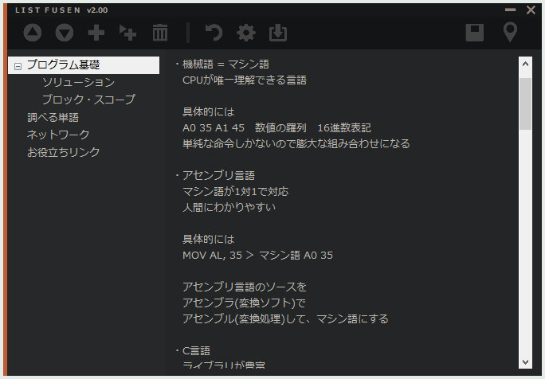

# List Fusen 2
付箋紙ツールのようなお手軽さとリスト管理を合わせたテキストエディタのVer.2  　  

　  
　  
**◆『List Fusen 2』について**  
　  
　こちらが本ツールの紹介記事になります。  
　[http://effect.hatenablog.com/entry/ListFusen2](http://effect.hatenablog.com/entry/ListFusen2) 
　  
　使用時は ListFusen2_00.exe を実行してください。  
　ツール上部のアイコンにカーソルを置くと説明文が表示されます。  
　  
　不具合報告は下記までお願いします。  
　https://twitter.com/moko_03_25  
　  
　  
**◆更新履歴**  
　  
　2019.06.15 ver.2.00  
　　リリースしました！  
　2019.06.16 ver.2.01  
　　オートバックアップの出力パスの不具合を修正しました。  
　2019.06.16 ver.2.02  
　　オートバックアップ時に前回のバックアップ日時を更新するよう対応。  
　　設定ファイル読み込みエラー時に初期値にするよう対応。  
　  
　  
**◆使用アイコンについて**  
　  
　binaryにはこちらのフリーアイコン素材を使用させて頂いていますが、GitHubにアップしたリソースには含まれていません。  
　『Free Icon Pack: 375 Retina-Display-Ready Icons』    
　　https://www.webpagefx.com/blog/web-design/375-retina-display-ready-icons/  
　  
moko
